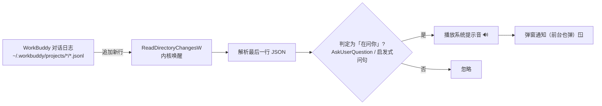

# ⏰ WorkBuddy 等待输入提醒器

> 当 WorkBuddy 在等你回复 / 向你提问时，弹一个 **Windows 通知 + 系统提示音**——
> 哪怕 WorkBuddy 窗口正挡在眼前，也不会再「悄悄卡住等你」而你没有察觉。


---

## 🤔 为什么会有这个小工具

WorkBuddy 桌面端在 **agent 等待你输入 / 提问** 时，**默认只提示在聊天窗口内**，不弹系统级通知。
窗口一旦被盖住，你就发现不了，agent 也只能干等——尤其在「台式 + 笔记本」多设备场景下格外恼火。

本工具自己当个「旁观者」：**盯着 WorkBuddy 的对话日志，一旦发现它在问你，立刻弹通知 + 响一声。**

---

## ✨ 特性

- 🔔 **精准触发**：默认只在 WorkBuddy 真正弹出「提问卡（AskUserQuestion）」时通知，绝不刷屏。
- 🧠 **双模式**：`precise`（精准，默认）/ `heuristic`（轻量启发式，连纯文字问句也提醒）。
- ⚡ **事件驱动**：用 Windows `ReadDirectoryChangesW` 监听日志，**空闲时阻塞睡大觉，零轮询、零空转**。
- 🔊 **一定有声音**：直接播放系统提示音 wav（后台进程也稳出声），不再静默。
- 🪟 **前台也弹**：不管 WorkBuddy 在前台还是后台，提问即通知。
- 🚪 **关闭即 0 内存**：关闭 = 直接杀掉进程，不留任何后台空转。
- 📦 **零依赖**：纯 Python 标准库 + 系统 PowerShell，无需 `pip install` 任何东西。

---

## 🛠 工作原理



> 监听的是 `~/.workbuddy/projects/<项目>/<uuid>.jsonl`。
> 精准模式下，触发条件是日志里出现 `type=="function_call"` 且 `name=="AskUserQuestion"` 的记录。

---

## 📁 文件结构

| 文件 | 作用 |
|---|---|
| `workbuddy_wait_notifier.py` | 主程序：监听日志 + 判定 + 弹通知（零依赖） |
| `notifier_config.json` | 配置文件：开关、模式、启发式前台策略 |
| `notifier-control.bat` | 一键开关入口（双击切换开/关，无黑框） |

---

## 🚀 快速开始

### 1. 开启监听

双击 **`notifier-control.bat`** → 弹「已开启」即生效（后台守护，事件驱动）。

或用命令行：

```powershell
python workbuddy_wait_notifier.py --on        # 开启
python workbuddy_wait_notifier.py --off       # 关闭（进程退出，0 内存）
python workbuddy_wait_notifier.py --toggle    # 切换
python workbuddy_wait_notifier.py --precise   # 切到精准模式并重启
python workbuddy_wait_notifier.py --heuristic # 切到启发式模式并重启
```

> 提示：若想开机自动开启，把 `notifier-control.bat` 放进「任务计划程序 → 登录时启动」即可（脚本默认 `enabled: true`）。

### 2. 验证

让 WorkBuddy 向你提一个问题（用提问卡），右下角应同时弹出通知并响一声提示音。

### 3. 关闭

再双击 `notifier-control.bat`（或在命令行 `--off`）。关闭后**进程不存在，内存占用为 0**。

---

## 🎛 两种模式

在 `notifier_config.json` 的 `"mode"` 字段切换：

| 模式 | 触发条件 | 行为 |
|---|---|---|
| `precise`（默认） | 日志出现 `AskUserQuestion` 提问卡 | **仅此一种情况**弹通知，前台后台都弹，绝不刷屏 |
| `heuristic` | 精准的全部 **+** assistant 以问号结尾的纯文本提问 | 纯文字提问**默认只在 WorkBuddy 不在前台时**提醒（避免你正看着时刷屏） |

> 想让启发式连前台也弹？把 `heuristic_notify_foreground` 改为 `true`。

---

## ⚙️ 配置项（`notifier_config.json`）

```json
{
  "enabled": true,
  "mode": "precise",
  "heuristic_notify_foreground": false
}
```

| 字段 | 说明 |
|---|---|
| `enabled` | `false` 时脚本启动即退出，连开机自启也不占内存 |
| `mode` | `precise` / `heuristic` |
| `heuristic_notify_foreground` | 启发式模式下，WorkBuddy 在前台时是否也提醒纯文字提问 |

---

## 🧪 实现笔记（踩过的坑）

为保证「稳定弹窗 + 有声音 + 不闪黑框」，修掉了几个真实问题：

1. **编码崩溃**：日志混入非 UTF-8 字节会导致守护进程一读就崩 → 改为二进制读 + 容错解码。
2. **BurntToast 假成功**：本机未装 BurntToast 却被误判发送成功，兜底弹窗永远到不了 → 改为必须真执行才算。
3. **黑框闪烁**：后台进程每次调 PowerShell 被 Windows 分配临时黑框 → 所有调用加 `CREATE_NO_WINDOW` + 隐藏窗口。
4. **没声音**：`SystemSounds` 在后台进程常不响 → 改用 `SoundPlayer` 直接播系统提示音 wav。
5. **弹不出窗（最致命）**：原用 `DETACHED_PROCESS` 落到非交互桌面，弹窗看不见 → 改为 `CREATE_NO_WINDOW`，留在你的桌面正常弹窗。

---

## 📝 使用前提

- Windows 系统（依赖 `ReadDirectoryChangesW` 与 Windows 通知/声音）。
- 已安装 Python 3（无需任何第三方包）。
- WorkBuddy 对话日志位于 `~/.workbuddy/projects/`（默认路径，无需配置）。

---

## 📄 许可证

个人工具 / 可自由取用（CC0-1.0）。无担保，按现状提供。
